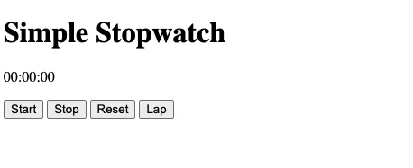
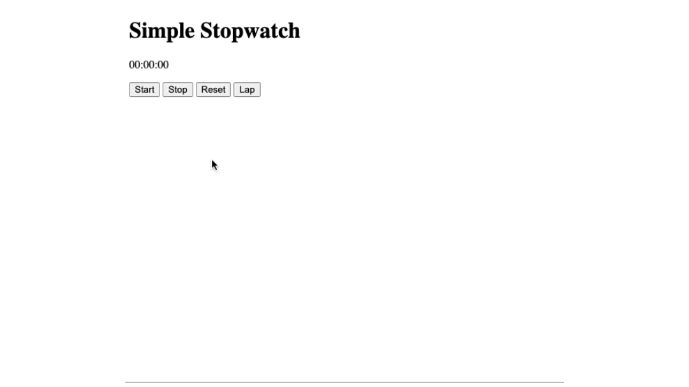
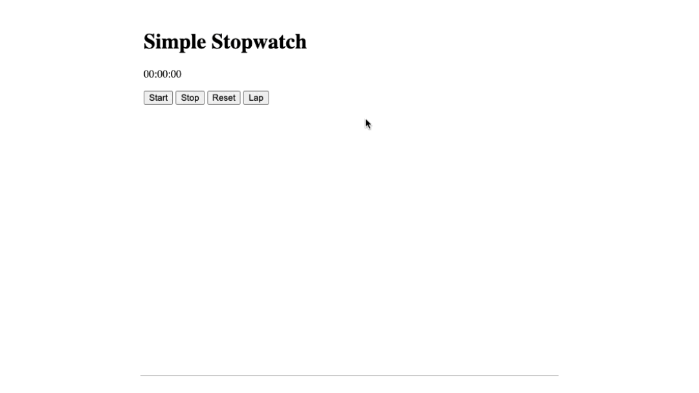

# simple stopwatch

- [simple stopwatch](#simple-stopwatch)
  - [learning](#learning)
  - [about](#about)
  - [stages](#stages)
    - [1: setting the scene](#1-setting-the-scene)
    - [2: start and stop the timer](#2-start-and-stop-the-timer)
    - [3: reset and lap the timer](#3-reset-and-lap-the-timer)

## learning
tie html, css, and javascript together to make a functional stopwatch. learn about setinterval and dom methods.

## about
the simple stopwatch project is a web application which allows users to time events with precision, offering features like start, stop, reset, and lap time recording. built an interface that can display elapsed time prominently and provides buttons for easy control. with this project, users can track multiple laps, making it ideal for fitness routines, sports events, or any timing needs. 

## stages
### 1: setting the scene
<details>
<summary>add the html elements to set the structure of the application</summary>

#### 1.1 description
welcome to the starting line of your coding race! in this first stage of "simple stopwatch," imagine you're crafting a sleek stopwatch app tailored for runners gearing up for their big race day. your first task is to create the essential html elements that will pave the way for a seamless timing experience.

picture this: the runners are lacing up their shoes, heartbeats quickening with anticipation. as the race director, your html toolkit must include:

title (h1): a bold and inspiring header that sets the pace for the challenge ahead. the text should be "simple stopwatch".

timer (p): the beating heart of your stopwatch, ready to track every second of the race. the starting text should be "00:00:00".

start, stop, reset, lap buttons: the control center for our runners, offering the power to kick off, pause, restart, and mark key moments in their journey.

with these elements in place, you're not just building a stopwatch—you're creating a tool that will help runners push their limits and achieve their personal best. get ready to code your way to the finish line! on your mark, get set, code!

#### 1.2 objectives
in this stage, within the `<body>` section, include:

- a heading level 1 (`<h1>`) element with the text "simple stopwatch".
- a paragraph (`<p>`) element with the id "timer" and the initial text "00:00:00".
- four buttons (`<button>`) with the following ids and texts:
  - "start" with text "start".
  - "stop" with text "stop".
  - "reset" with text "reset".
  - "lap" with text "lap".

the html structure should adhere to the provided format while ensuring appropriate tag nesting and attribute usage.

#### 1.3 examples
example 1:



</details>

### 2: start and stop the timer
<details>
<summary>add the start and stop functionalities of the stopwatch</summary>

#### 2.1 description
get those coding sneakers on! in this stage, it's time to lace up your javascript skills and implement the start and stop functionalities for our stopwatch app. picture this: you're gearing up runners for the race of a lifetime, and every millisecond counts!

your mission is to display the crucial metrics of time: minutes, seconds, and milliseconds, all in a sleek and user-friendly interface. when the runners hit that stop button, it's not game over! they should be able to pause, catch their breath, and then seamlessly resume from the exact moment they left off.

so, strap in, get ready to code like the wind, and let's build a stopwatch that'll have those runners race-ready in no time!

#### 2.2 objectives
in this stage, you should:

- handle start button click event:
  - when the start button is pressed, the timer should start.
  - display the time in the format minutes, seconds, and hundredths of seconds (mm:ss:ms) (see the below example).
  - ensure the timer only starts if it's not already running.
- handle stop button click event:
  - after pressing the stop button, stop the timer.
  - ensure the timer is stopped only if it's currently running.
- resume timer after pressing start:
  - when the start button is pressed again after stopping, the timer should continue from where it left off.

#### 2.3 examples
example 1:



</details>

### 3: reset and lap the timer 
<details>
<summary>add the reset and lap functionalities of the stopwatch</summary>

#### 3.1 description
alright, sprinters and marathoners in the making, it's time to dive into the heart of our stopwatch app! in the third stage, we're continuing the power of javascript to the track.

reset – ready, set, go again! when the runners need a fresh start, they hit the reset button. your task is to make sure that this button sends our timer back to the starting line, ready for the next lap.

lap – keep track of your progress! every time the athletes complete a lap, they want to capture that moment. implement the lap functionality to record these lapped times as a list item. each press should add a new achievement to the list, showcasing their progress with each stride.

list – where victories are documented! to display these triumphant laps, introduce an unordered or ordered list in the body of our app. this list will serve as a testament to the dedication and hard work of our aspiring racers. let the victories stack up in style!

race day prep mode: engaged! imagine the excitement of race day approaching. with your javascript skills, you're not just coding an app—you're crafting a training companion for our runners. every line of code is a step closer to the finish line.

so, runners and coders alike, let's sprint through this stage with enthusiasm and determination. the stopwatch app is taking shape, and with each feature you implement, you're helping our athletes gear up for victory! on your marks, get set, code!

#### 3.2 objectives
in this stage, you should:
- add a list:
  - add a list (unordered or ordered) with id "laps" to the body of the html.
- handle reset button click event:
  - when the reset button is pressed, set the timer display to "00:00:00".
  - also, clear the list of laps.
- handle lap button click event:
  - when the lap button is pressed, create a new list item (`<li>`) with the current lap time.
  - append the new list item to the list with the id "laps" to display the lap times.

#### 3.3 examples
example 1:



</details>

[<<](https://github.com/eucarizan/front-end/blob/main/README.md)
<!--
:%s/\(Sample \(Input\|Output\) \d:\)\n\(.*\)/```\r\r**\1**\r```\3/gc

### 0: 
<details>
<summary></summary>

#### 0.1 description

#### 0.2 objectives

#### 0.3 examples

</details>
-->

